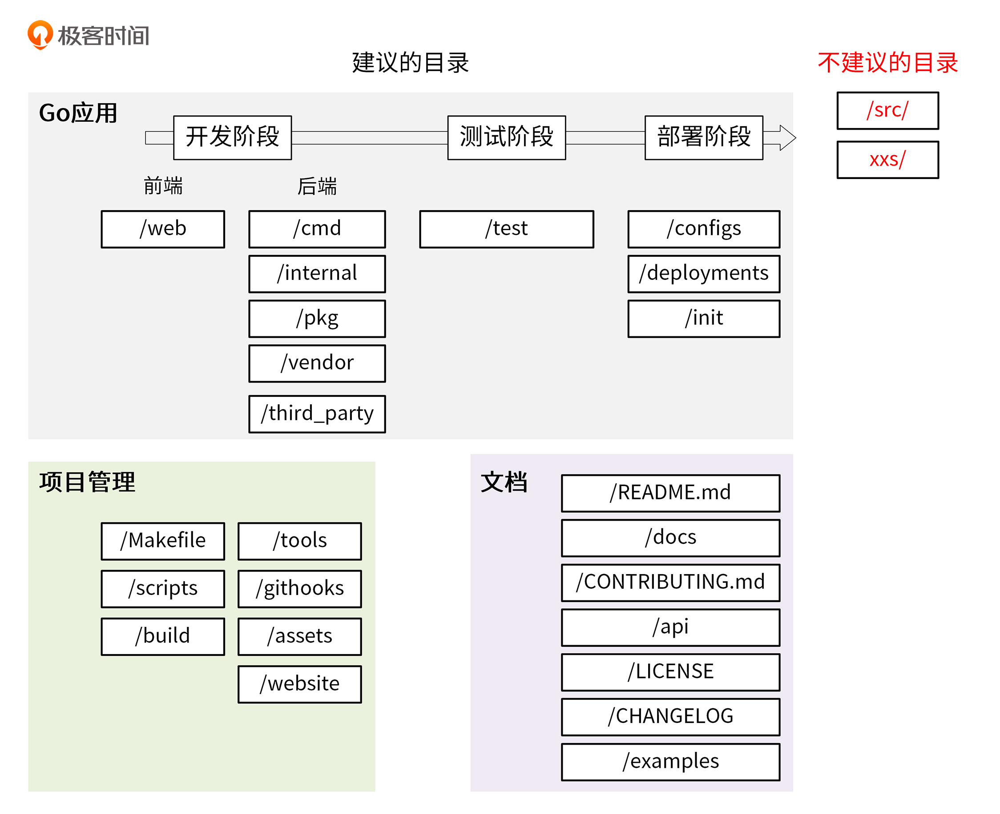
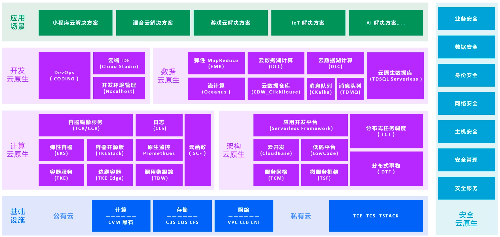
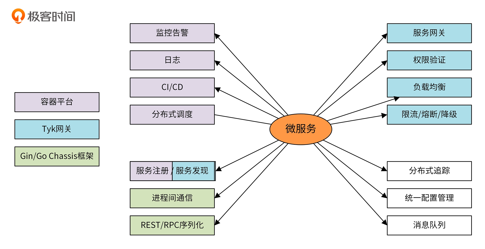

## TODO
- catalogue (according layer or function)
- init project
- grpc
- swagger
- business exception code
- Error(Exception)

## tools
- RBAC/ABAC: Casbin/go-admin/gin-admin
- UI HTTP: apifox/Insomnia
# db to database
- Gorm: reverse to generate the struct base on database column 
- SDK: openapi-generator
- performance: pprof/wrk
- serverless: knative
- log: Elasticsearch、FlieBeat、Kibana、logstash
- microservice-trace: Jaeger
- microservice-framework: go-chassis、go-micro
- k8s-yaml-validator: kubeval/kube-score
- local-develop: nocalhost

## Cloud native architecture

## Cloud server provider 
 
## microservice technology stack 

## golang directory hierarchy
